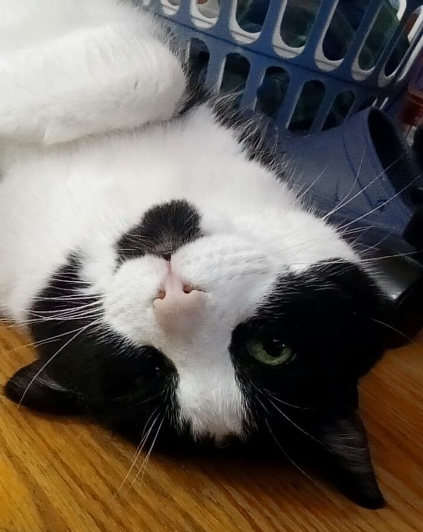

<link rel="stylesheet" href="https://cdnjs.cloudflare.com/ajax/libs/font-awesome/6.0.0/css/all.min.css" integrity="sha512-9usAa10IRO0HhonpyAIVpjrylPvoDwiPUiKdWk5t3PyolY1cOd4DSE0Ga+ri4AuTroPR5aQvXU9xC6qOPnzFeg==" crossorigin="anonymous" referrerpolicy="no-referrer" />
# Hi, I'm William!

I'm a computer science graduate from Western University. On this blog I will post about a variety of 
things, mostly about my experiences while programming.

In my spare time I enjoy blitz chess, drawing cartoon characters, and bubble tea. 
I also have a really cute cat, so look out for her.

