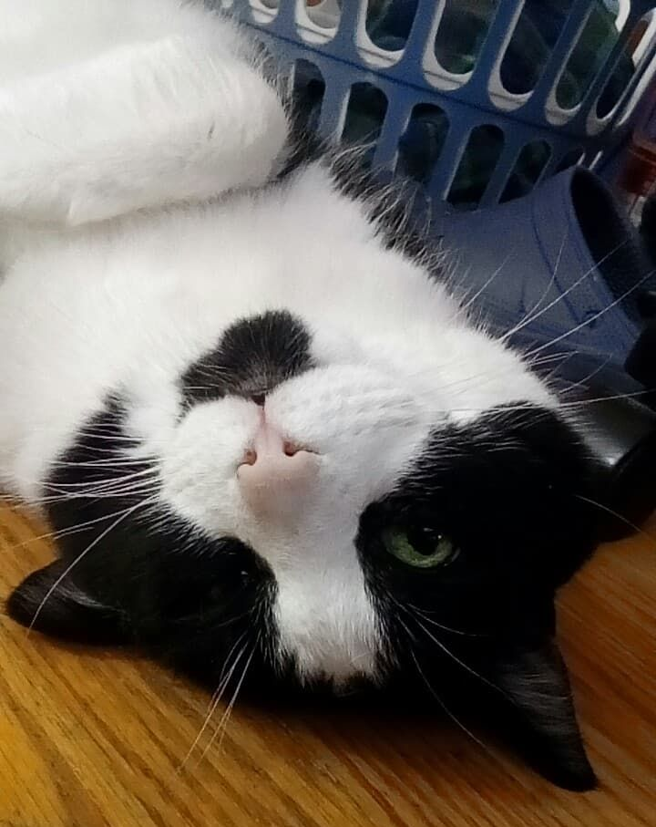

<link rel="stylesheet" href="https://cdnjs.cloudflare.com/ajax/libs/font-awesome/6.0.0/css/all.min.css" integrity="sha512-9usAa10IRO0HhonpyAIVpjrylPvoDwiPUiKdWk5t3PyolY1cOd4DSE0Ga+ri4AuTroPR5aQvXU9xC6qOPnzFeg==" crossorigin="anonymous" referrerpolicy="no-referrer" />
# Hi! I'm William!

I'm a computer science graduate from Western University,
and this is my blog. Here, I will post about a variety of 
things, though mostly about my experiences while programming.

I have a really cute cat though, so look out for her as well.

# Projects

# Contact Me 

<i class="fab fa-linkedin-in"></i><a href="https://www.linkedin.com/in/william-ngo-a8a1871b8"> William Ngo</a>

<i class="fab fa-github"></i> wngo1337

